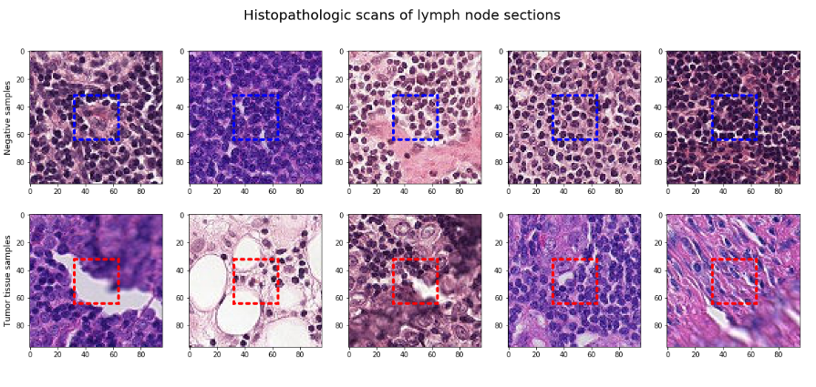
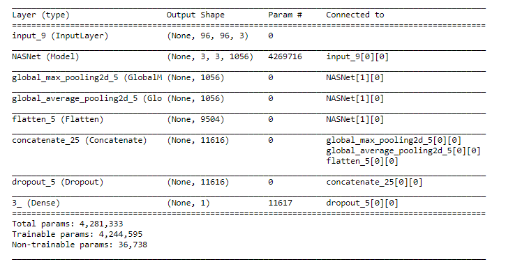
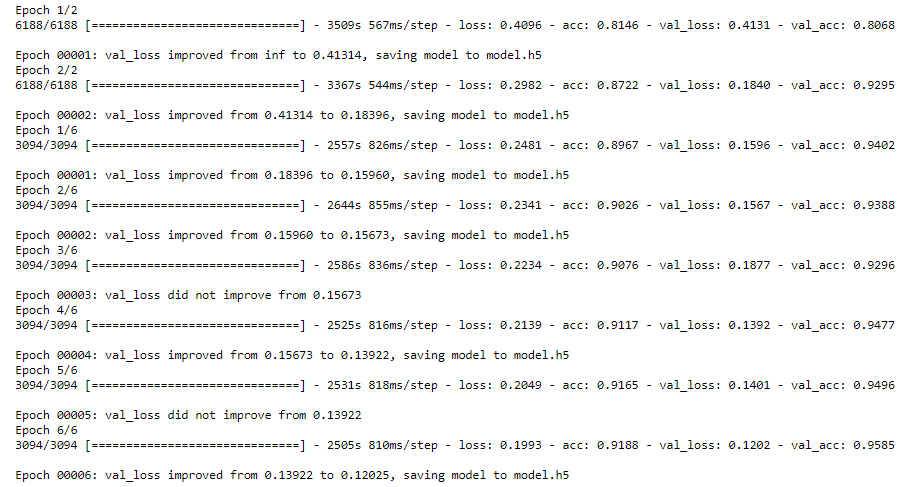
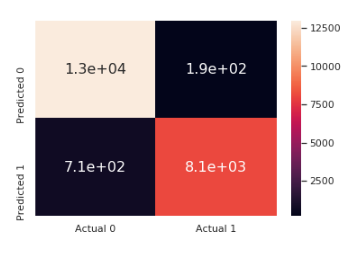

# Histopathologic Cancer Detection [Genovision]
## Training
**You can view the training process in more detail in the "Histopathological Cancer Detection - training" notebook.**

In this repository, we've create an algorithm to identify metastatic cancer in small image patches (92 by 92 pixels) taken from larger digital pathology scans. The data we've used is a slightly modified version of the PatchCamelyon (PCam) benchmark dataset, that you can find here https://github.com/basveeling/pcam (the original PCam dataset contains duplicate images due to its probabilistic sampling, however, the version presented on Kaggle does not contain duplicates, which we've used in this model) .

PCam is highly interesting for both its size, simplicity to get started on, and approachability. In the authors' words: PCam packs the clinically-relevant task of metastasis detection into a straight-forward binary image classification task, akin to CIFAR-10 and MNIST. Models can easily be trained on a single GPU in a couple hours, and achieve competitive scores in the Camelyon16 tasks of tumor detection and whole-slide image diagnosis. Furthermore, the balance between task-difficulty and tractability makes it a prime suspect for fundamental machine learning research on topics as active learning, model uncertainty, and explainability.

### Dataset

In this dataset, we are provided with a large number of small pathology images to classify. Files are named with an image id. The train_labels.csv file provides the ground truth for the images in the train folder. A positive label indicates that the center 32x32px region of a patch contains at least one pixel of tumor tissue. Tumor tissue in the outer region of the patch does not influence the label. This outer region is provided to enable fully-convolutional models that do not use zero-padding, to ensure consistent behavior when applied to a whole-slide image, which we will demonstrate in the prediction phase.

### Model

For the model, we have fine-tuned a NASNet network to fit this particular task, which we will train in order to get a good accuracy on the validation set.

### Training

We have proceeded to train the model on the data while validating both the loss and the accuracy score in order to get a good idea on its performance.

### Assessing performance
In the end, this model has enabled us to obtain an AUC-ROC score of 0.9526 which is good enough to point out with a good accuracy the regions where the cancer probably is present, thus greatly contributing to a doctor's diagnosis.

We have also visualized the confusion matrix in order to further assess the performance of the model.

## Prediction Testing
**You can view the testing process in more detail in the "Histopathological Cancer Prediction" notebook.**

In the prediction phase, we load our previously trained model and test it on some images and then visualize the result.

### Sliding Window Algorithm

We implement a sliding window algorithm (since the model is trained on 96x96 pixel-size images) in order to identify cancer in each region of the scan by running through the model which is trained on such scans.

### Connected Component Labeling

We then run a Connected-Component Labeling algorithm that will idetify the connected regions in which cancer exists and label them accordingly (it gives a distinct label to each connected region).

### Visualize Results

Finally, we use the labeling in order to visualize them for the diagnosis. This done in two different ways in order to give the doctor helpful insight on where the damaged tissues might be:

Use the labels to get bounding boxes for each region, that we display accordingly.
Overlay the resulting regions and mark the labelled ones with a distinct color to give the precise locations of where the cancer tissue is most likely at.

* You can see an example of this algorithm in action :

Moreover, you can see more examples in the "Testing Histopathologic Predictions" notebook.
